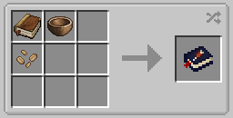

<h2 style="text-align: center;">Farmer's Delight Cookbook Reforged</h2>
<h2 style="text-align: center;">农夫的喜悦食谱重新锻造</h2>

<strong>This is an unofficial version of&nbsp;<em><a href="https://www.curseforge.com/minecraft/mc-mods/farmers-delight-cookbook-addon">Farmer's Delight Cookbook&nbsp;</a></em>, available on 1.18.2+. </strong> <strong>这是一个非官方版本的<a href="https://www.curseforge.com/minecraft/mc-mods/farmers-delight-cookbook-addon">农民的喜悦食谱&nbsp;</a>，可在1.18.2+。 </strong>

<strong>This book can help you explore the world of Farmer's Delight.</strong> <strong>这本书可以帮助你探索农民的喜悦的世界。</strong>

<strong>There are some contents of <em>Farmer's Delight</em> haven't be implemented to this CookBook, I plan to update in future.</strong>

&nbsp;

<strong>But first, you must craft a cookbook:</strong>

<strong></strong>

&nbsp;

<strong>And have fun.</strong>

 有一些内容还没有实现，我计划在未来更新。
